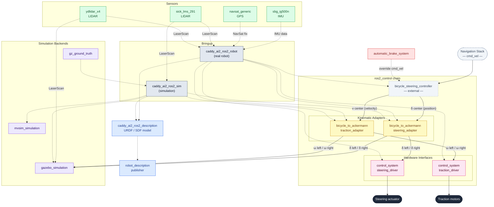

# Caddy AI2 — Package Architecture

## Package Relationships

---

## Package Index

| Package | Type | Description |
|---|---|---|
| `caddy_ai2_ros2_robot` | Bringup | Real robot launch: wires controllers, drivers and sensors |
| `caddy_ai2_ros2_sim` | Bringup | Simulation launch: Gazebo and MVSim |
| `caddy_ai2_ros2_description` | Description | URDF / SDF robot model shared by real and sim |
| `caddy_ai2_ros2_robot_description_publisher` | Utility | Publishes robot_description topic |
| `bicycle_to_ackermann_steering_adapter` | Controller | Chainable: bicycle center angle → individual Ackermann steering angles |
| `bicycle_to_ackermann_traction_adapter` | Controller | Chainable: bicycle center velocity → individual wheel velocities |
| `caddy_ai2_ros2_control_system_steering_driver` | Hardware Interface | ros2_control HW interface for real steering actuator |
| `caddy_ai2_ros2_control_system_traction_driver` | Hardware Interface | ros2_control HW interface for real traction motors |
| `caddy_ai2_ros2_control_sensors_sbg_ig500n` | Sensor | IMU driver (SBG IG-500N) — ROS 2 node + ros2_control HW interface |
| `caddy_ai2_ros2_sensors_sick_lms_291` | Sensor | LIDAR driver (SICK LMS 291) |
| `caddy_ai2_ros2_sensors_ydlidar_x4` | Sensor | LIDAR driver (YDLidar X4) |
| `caddy_ai2_ros2_sensors_navsat_generic` | Sensor | Generic GPS / NavSat bridge |
| `caddy_ai2_ros2_automatic_brake_system` | Safety | Monitors sensors and overrides cmd_vel to brake if needed |
| `caddy_ai2_ros2_gazebo_simulation` | Simulation | Gazebo world + ros_gz_bridge; reuses kinematic adapters |
| `caddy_ai2_ros2_mvsim_simulation` | Simulation | MVSim world definition |
| `gz_ground_truth` | Simulation | Gazebo ground-truth pose publisher |
